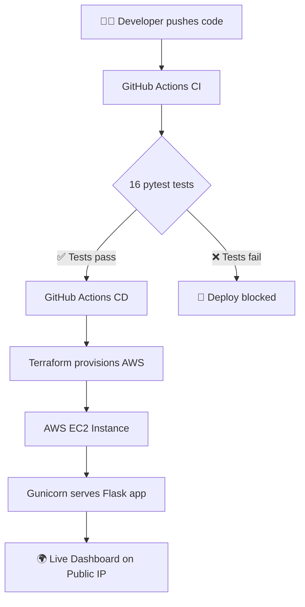

# ⚡ DevOps Health Dashboard


A real-time system health monitoring dashboard built with Python and Flask, featuring a complete CI/CD pipeline using GitHub Actions and AWS infrastructure provisioned with Terraform.

---

## 🌍 Live Demo
> Dashboard deployed on AWS EC2 via automated CD pipeline

---

## 🏗️ Architecture



---

## 🛠️ Tech Stack

| Layer | Technology |
|---|---|
| Application | Python, Flask, psutil |
| Testing | pytest (16 automated tests) |
| CI/CD | GitHub Actions |
| Infrastructure | Terraform |
| Cloud | AWS EC2, Security Groups |
| Web Server | Gunicorn |
| OS | Amazon Linux 2 |

---

## ✨ Features

- **Real-time metrics** — CPU, memory and disk usage displayed live
- **REST API** — three endpoints following REST design principles
- **Health check endpoint** — production-ready `/health` endpoint
- **Automated testing** — 16 pytest tests covering routes and metrics
- **CI pipeline** — tests run automatically on every push
- **CD pipeline** — infrastructure provisioned and deployed automatically
- **Infrastructure as Code** — entire AWS setup defined in Terraform

---

## 📁 Project Structure

```
devops-health-dashboard/
│
├── app/
│   ├── __init__.py          # Flask app initialization
│   ├── routes.py            # REST API endpoints
│   ├── metrics.py           # System metrics collection
│   └── templates/
│       └── dashboard.html   # Dashboard UI
│
├── tests/
│   ├── test_routes.py       # API endpoint tests
│   └── test_metrics.py      # Metrics module tests
│
├── terraform/
│   ├── main.tf              # EC2 and Security Group
│   ├── variables.tf         # Input variables
│   └── outputs.tf           # Output values
│
├── .github/
│   └── workflows/
│       ├── test.yml         # CI pipeline
│       └── deploy.yml       # CD pipeline
│
├── run.py                   # Application entry point
└── requirements.txt         # Python dependencies
```

---

## 🚀 API Endpoints

| Endpoint | Method | Description |
|---|---|---|
| `/` | GET | Dashboard UI with live metrics |
| `/health` | GET | Health check — returns `{"status": "healthy"}` |
| `/metrics` | GET | Raw system metrics in JSON |

---

## 🏃 Run Locally

```bash
# Clone the repo
git clone https://github.com/mopaul873/devops-health-dashboard.git
cd devops-health-dashboard

# Create virtual environment
python -m venv venv
source venv/Scripts/activate  # Windows
source venv/bin/activate       # Mac/Linux

# Install dependencies
pip install -r requirements.txt

# Run the app
python run.py
```

Visit **http://127.0.0.1:5000** in your browser.

---

## 🧪 Run Tests

```bash
pytest tests/ -v
```

---

## ☁️ Deploy to AWS

```bash
# Configure AWS credentials
aws configure

# Initialize Terraform
cd terraform
terraform init

# Preview infrastructure
terraform plan

# Deploy
terraform apply

# Destroy when done
terraform destroy
```

---

## 🔧 CI/CD Pipeline

Every push to `main` automatically:
1. Spins up Ubuntu server on GitHub
2. Installs Python and dependencies
3. Runs all 16 pytest tests
4. If tests pass → runs Terraform
5. Provisions AWS infrastructure
6. Deploys application
7. Outputs live dashboard URL

⏱️ Total pipeline duration: **~1 minute**

---

## 📊 What I Learned

- Building REST APIs with Flask following production patterns
- Writing automated tests with pytest (unit and integration)
- Setting up CI/CD pipelines with GitHub Actions
- Provisioning cloud infrastructure with Terraform
- Deploying production applications with Gunicorn
- AWS EC2, Security Groups and networking basics
- Git workflow with conventional commits

---

## 👨‍💻 Author

**Momo, Paul**
- GitHub: [@mopaul873](https://github.com/mopaul873)
- AWS Certified Cloud Practitioner
- AS Computer Science — December 2026

